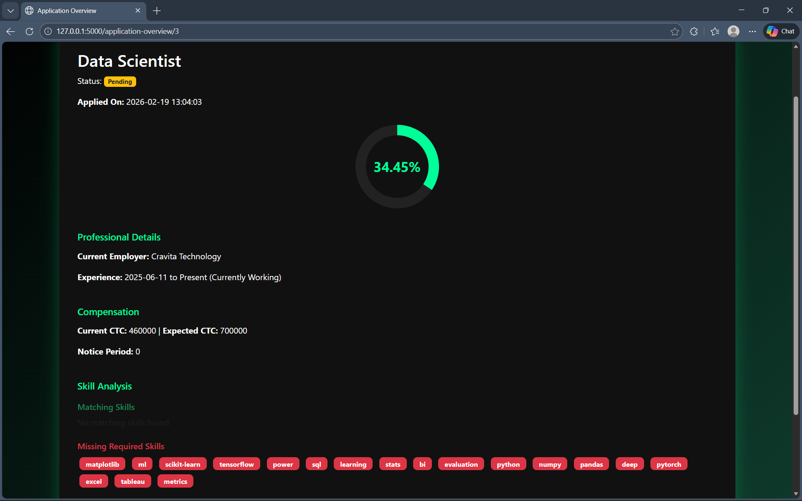
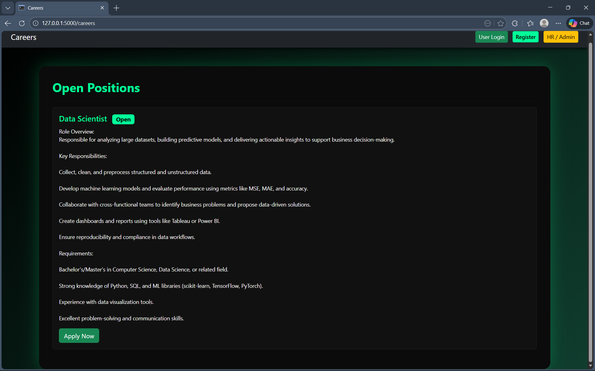
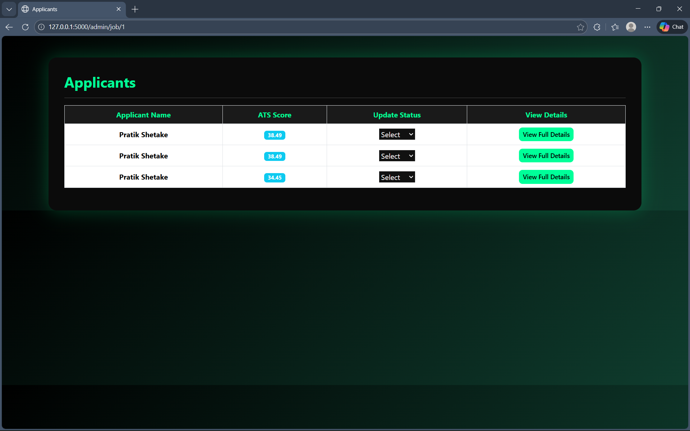

# 🚀 Resume Screening System (ATS)

  <b>A Flask-based Applicant Tracking System with Skill Matching & ATS Score Analysis</b>

 

  
  
  
  
  
  
  
  

 

## 📌 About The Project

The **Resume Screening System** is a Flask-based Applicant Tracking System (ATS) that:

- Allows candidates to apply for jobs
- Extracts resume data from PDF
- Performs skill matching
- Calculates ATS score
- Identifies:
  - ✅ Matching Skills
  - ❌ Missing Skills
  - ⚠ Irrelevant Skills
- Enables Admin to:
  - View applicants
  - Shortlist candidates
  - Reject candidates
  - Close/Reopen jobs

---

## 🎯 Key Features

- 🔍 Resume PDF Text Extraction  
- 🧠 NLP-based Skill Analysis  
- 📊 Circular ATS Score Progress Bar  
- 👨‍💼 Admin Dashboard  
- 👤 User Dashboard  
- 📂 Application Overview Page  
- 🏷 Skill Tag Input (Comma / Space separated)

---

## 🛠 Tech Stack

- **Backend:** Python, Flask  
- **Database:** SQLite  
- **Frontend:** HTML, CSS, Bootstrap  
- **NLP:** NLTK  
- **PDF Processing:** PyPDF2 / pdfminer  

---

## 📁 Project Structure

